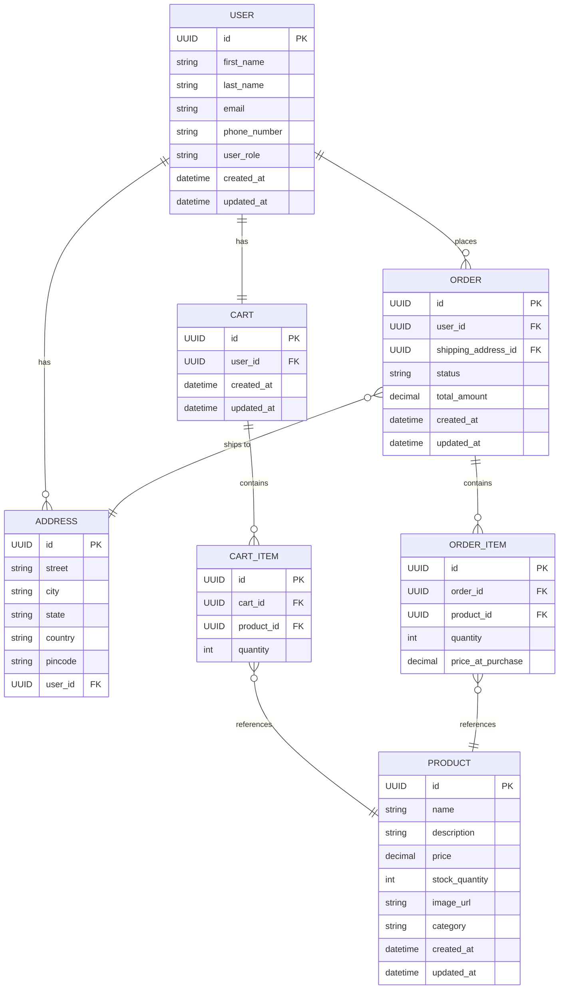

# Ecommerce Application

A microservice-based e-commerce backend built with Spring Boot 3.x and Java 21.

## Tech Stack

- **Framework**: Spring Boot 3.5.6
- **Language**: Java 21
- **Security**: Spring Security + JWT (jjwt 0.13.0)
- **Persistence**: Spring Data JPA
- **Database**: H2 (development)
- **Validation**: Spring Boot Starter Validation
- **Utilities**: Lombok
- **Build**: Maven

## Project Status

> Early development phase — services and features are being added incrementally.

## Data Model

### Entities

| Entity | Table | Description |
|--------|-------|-------------|
| `User` | `users` | Stores user profile and role |
| `Address` | `addresses` | Stores addresses linked to a user (one-to-many) |
| `Product` | `products` | Stores product details including price, stock, image and category |
| `Cart` | `cart` | One cart per user, holds cart items |
| `CartItem` | `cart_items` | Each item in a cart with a product reference and quantity |
| `Order` | `orders` | An order placed by a user, with status and shipping address |
| `OrderItem` | `order_items` | Each item in an order with price snapshot at time of purchase |

### Relationships

- A `User` can have **many** `Address` records (`@OneToMany`)
- Each `Address` belongs to **one** `User` (`@ManyToOne`, FK: `user_id`)
- A `User` has **one** `Cart` (`@OneToOne`, FK: `user_id`)
- A `Cart` can have **many** `CartItem` records (`@OneToMany`)
- Each `CartItem` references **one** `Product` (`@ManyToOne`, FK: `product_id`)
- A `User` can have **many** `Order` records (`@ManyToOne`, FK: `user_id`)
- Each `Order` has **many** `OrderItem` records (`@OneToMany`)
- Each `OrderItem` references **one** `Product` (`@ManyToOne`, FK: `product_id`)
- Each `Order` has a shipping `Address` (`@ManyToOne`, FK: `shipping_address_id`)

### Enums

| Enum | Values |
|------|--------|
| `UserRole` | `CUSTOMER`, `ADMIN` |
| `Category` | `ELECTRONICS`, `CLOTHING`, `FOOTWEAR`, `GROCERIES`, `FURNITURE`, `BOOKS` |
| `OrderStatus` | `PENDING`, `CONFIRMED`, `SHIPPED`, `DELIVERED`, `CANCELLED` |

## Entity Relationship Diagram



## Modules / Services

> To be documented as services are added.

## Getting Started

### Prerequisites

- Java 21+
- Maven 3.8+

### Run Locally

```bash
mvn spring-boot:run
```

The application starts on `http://localhost:8080` by default.

## API Overview

### Users

| Method | Endpoint | Description |
|--------|----------|-------------|
| GET | `/internal/users` | Retrieve all users with full details (internal) |
| GET | `/api/users/{id}` | Retrieve a user by UUID |
| POST | `/api/users` | Create a new user |
| PUT | `/api/users/{id}` | Update an existing user |
| POST | `/api/users/{id}/addresses` | Add a new address to an existing user |
| POST | `/api/users/{id}/cart` | Add a product to the user's cart |

#### User Request Body (`POST` / `PUT`)

```json
{
  "firstName": "John",
  "lastName": "Doe",
  "email": "john.doe@example.com",
  "phoneNumber": "9876543210",
  "userRole": "CUSTOMER",
  "addresses": [
    {
      "street": "123 Main St",
      "city": "Chennai",
      "state": "Tamil Nadu",
      "country": "India",
      "pincode": "600001"
    }
  ]
}
```

> `addresses` is optional — omit it to create a user without any address.

> `userRole` accepted values: `CUSTOMER`, `ADMIN`

#### User Response Body

```json
{
  "firstName": "John",
  "lastName": "Doe",
  "email": "john.doe@example.com",
  "phoneNumber": "9876543210",
  "userRole": "CUSTOMER",
  "addresses": [
    {
      "id": "uuid-here",
      "street": "123 Main St",
      "city": "Chennai",
      "state": "Tamil Nadu",
      "country": "India",
      "pincode": "600001"
    }
  ]
}
```

#### Add Address Request Body (`POST /api/users/{id}/addresses`)

```json
{
  "street": "456 Park Avenue",
  "city": "Bangalore",
  "state": "Karnataka",
  "country": "India",
  "pincode": "560001"
}
```

> Returns `200 OK` with no body on success.

#### Add to Cart Request Body (`POST /api/users/{id}/cart`)

```json
{
  "productId": "uuid-of-product",
  "quantity": 2
}
```

#### Add to Cart Response Body

```json
{
  "userFullName": "John Doe",
  "cartItems": [
    {
      "productName": "Wireless Headphones",
      "productPrice": 2999.99,
      "quantity": 2,
      "totalPrice": 5999.98
    }
  ],
  "cartTotal": 5999.98
}
```

> A cart is created automatically on first item add. Subsequent calls append items to the same cart.

### Cart

| Method | Endpoint | Description |
|--------|----------|-------------|
| GET | `/api/users/{id}/cart` | Get the user's current cart |
| DELETE | `/api/users/{id}/cart/{cartItemId}` | Remove an item from the cart |

### Orders

| Method | Endpoint | Description |
|--------|----------|-------------|
| POST | `/api/users/{id}/orders` | Place an order from the user's cart |
| GET | `/api/users/{id}/orders` | Get all orders for a user |

#### Place Order Request Body (`POST /api/users/{id}/orders`)

```json
{
  "shippingAddressId": "uuid-of-address"
}
```

#### Place Order Response Body

```json
{
  "userFullName": "John Doe",
  "orderItems": [
    {
      "productName": "Wireless Headphones",
      "quantity": 2,
      "priceAtPurchase": 2999.99,
      "totalPrice": 5999.98
    }
  ],
  "status": "PENDING",
  "totalAmount": 5999.98,
  "shippingAddress": "123 Main St, Chennai, Tamil Nadu, India - 600001",
  "createdAt": "2026-04-17T10:00:00"
}
```

> Cart is automatically cleared after a successful order placement.

> `status` accepted values: `PENDING`, `CONFIRMED`, `SHIPPED`, `DELIVERED`, `CANCELLED`

### Products

| Method | Endpoint | Description |
|--------|----------|-------------|
| GET | `/api/internal/products` | Retrieve all products with full details (internal) |
| GET | `/api/products/search?name={name}` | Search products by name (partial, case-insensitive) |
| GET | `/api/products/category/{category}` | Retrieve all products by category |
| POST | `/api/products` | Create a new product |
| DELETE | `/api/products/{id}` | Delete a product by UUID |

#### Product Request Body (`POST /api/products`)

```json
{
  "name": "Wireless Headphones",
  "description": "Noise cancelling over-ear headphones",
  "price": 2999.99,
  "stockQuantity": 50,
  "imageUrl": "https://example.com/images/headphones.jpg",
  "category": "ELECTRONICS"
}
```

> `description` and `imageUrl` are optional.

#### Product Response Body

```json
{
  "name": "Wireless Headphones",
  "description": "Noise cancelling over-ear headphones",
  "price": 2999.99,
  "stockQuantity": 50,
  "imageUrl": "https://example.com/images/headphones.jpg",
  "category": "ELECTRONICS"
}
```

> `category` accepted values: `ELECTRONICS`, `CLOTHING`, `FOOTWEAR`, `GROCERIES`, `FURNITURE`, `BOOKS`
