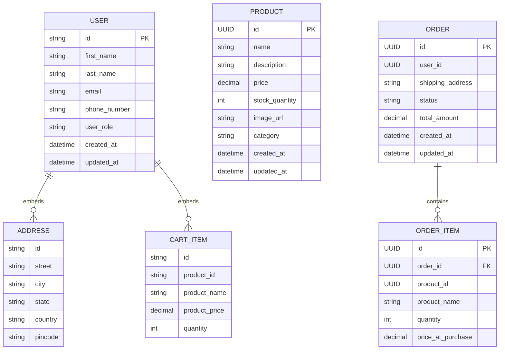

# Ecommerce Application

A microservice-based e-commerce backend built with Spring Boot 3.x and Java 21.

## Tech Stack

| Concern | Technology |
|---------|------------|
| Framework | Spring Boot 3.5.6 |
| Language | Java 21 |
| Persistence | Spring Data JPA / Spring Data MongoDB |
| Database | PostgreSQL 16 (product, order services), MongoDB 7 (user-service) |
| Validation | Spring Boot Starter Validation |
| Utilities | Lombok |
| Build | Maven |
| Containerisation | Docker + Docker Compose |
| Monitoring | Spring Boot Actuator |
| Service Discovery | Netflix Eureka |
| Inter-service Communication | Spring HTTP Interface (`RestClient` + `@LoadBalanced`) |

## Architecture

Four independently deployable services — one registry, three business services each with its own database:

| Service | Port | Database | Responsibility |
|---------|------|----------|----------------|
| `eureka-server` | 8761 | — | Service registry |
| `user-service` | 8081 | `ecommerce_users` (MongoDB) | Users, addresses, cart |
| `product-service` | 8082 | `ecommerce_products` (PostgreSQL) | Products, categories, stock |
| `order-service` | 8083 | `ecommerce_orders` (PostgreSQL) | Orders, order items |

## Data Model

### Entities per Service

**user-service** (MongoDB)

| Document | Collection | Description |
|----------|------------|-------------|
| `User` | `users` | User profile and role; embeds addresses and cart items |
| `Address` | *(embedded in User)* | Address subdocument |
| `CartItem` | *(embedded in User)* | Cart item subdocument — stores product snapshot (name, price) |

**product-service** (PostgreSQL)

| Entity | Table | Description |
|--------|-------|-------------|
| `Product` | `products` | Product details, stock, image, category |

**order-service** (PostgreSQL)

| Entity | Table | Description |
|--------|-------|-------------|
| `Order` | `orders` | Order placed by a user, with status and shipping address |
| `OrderItem` | `order_items` | Line items with price snapshot at time of purchase |

### Enums

| Enum | Service | Values |
|------|---------|--------|
| `UserRole` | user-service | `CUSTOMER`, `ADMIN` |
| `Category` | product-service | `ELECTRONICS`, `CLOTHING`, `FOOTWEAR`, `GROCERIES`, `FURNITURE`, `BOOKS` |
| `OrderStatus` | order-service | `PENDING`, `CONFIRMED`, `SHIPPED`, `DELIVERED`, `CANCELLED` |

## Entity Relationship Diagram



> `USER`, `ADDRESS`, and `CART_ITEM` are a single MongoDB document. Cross-service relationships (User→Order, CartItem→Product, OrderItem→Product) are maintained by ID references, not JPA foreign keys.

## Business Decisions

- **Product snapshot on cart/order**: `CartItem` and `OrderItem` store `productName` and `price` at the time of addition, so price changes do not affect existing carts or orders.
- **Cart embedded in User**: Cart items are stored directly on the `User` MongoDB document — no separate cart collection or repository.
- **Cart cleared on order**: Placing an order clears the user's cart atomically.
- **Stock validation**: Stock is checked before an order is placed. Insufficient stock throws an error with the product name and available quantity.
- **Stock restored on cancel**: Cancelling an order restores stock for every line item.
- **Cancel guard**: Orders with status `DELIVERED` or `CANCELLED` cannot be cancelled.
- **Address ownership**: Shipping address is validated to belong to the requesting user before placing an order.
- **Service discovery via Eureka**: Services resolve each other by logical name (`http://user-service`, `http://product-service`) — no hardcoded URLs in inter-service calls.
- **Self-preservation enabled**: Eureka retains registered instances during network partitions rather than mass-evicting them (threshold: 85% heartbeat renewal).
- **Graceful shutdown**: All services drain in-flight requests before stopping (30s window). Docker `stop_grace_period` is set to 35s to give the JVM time to complete before `SIGKILL`.

## Getting Started

### Prerequisites

- Docker + Docker Compose

### Run

```bash
docker compose up --build
```

Starts PostgreSQL, MongoDB, Eureka, and all three services.

| Service | URL |
|---------|-----|
| eureka-server | http://localhost:8761 |
| user-service | http://localhost:8081 |
| product-service | http://localhost:8082 |
| order-service | http://localhost:8083 |

### Actuator

Each service exposes `/actuator` on its port.

| Endpoint | Description |
|----------|-------------|
| `/actuator/health` | App and DB health |
| `/actuator/info` | App metadata |
| `/actuator/metrics` | JVM and HTTP metrics |
| `/actuator/mappings` | All registered HTTP endpoints |

## API Documentation

See [swagger.yml](swagger.yml) for the full OpenAPI 3.0 specification covering all endpoints across all three services.
